| Path | Metaphor | Intended Role | Notes |
|------|----------|---------------|-------|
| Pequod/ | Pequod | Docs & notebooks hub |  |
| Pequod/Chartroom/ | Chartroom | High-level overviews + config |  |
| Pequod/Chartroom/Maps/ | Maps |  |  |
| Pequod/Chartroom/Logbook/ | Logbook |  |  |
| Ocean/ | Ocean | Data lake |  |
| Ocean/England_1/ | England_1 | Premier League data |  |
| Ocean/England_1/Folder_1/ | Folder_1 |  |  |
| Ocean/England_1/Folder_1/scripts/ |  |  |  |
| Ocean/England_1/Folder_1/maps/ |  |  |  |
| Ocean/England_1/Folder_1/outputs/ |  |  |  |
| Ocean/England_1/Folder_2/ | Folder_2 |  |  |
| Ocean/England_1/Folder_2/scripts/ |  |  |  |
| Ocean/England_1/Folder_2/maps/ |  |  |  |
| Ocean/England_1/Folder_2/outputs/ |  |  |  |
| Ocean/England_1/Folder_3/ | Folder_3 |  |  |
| Ocean/England_1/Folder_3/scripts/ |  |  |  |
| Ocean/England_1/Folder_3/maps/ |  |  |  |
| Ocean/England_1/Folder_3/outputs/ |  |  |  |
| Ocean/England_2/ | England_2 | Championship data |  |
| Armory/ | Armory | Feature-engineering pipelines |  |
| Armory/Gam/ | Gam | Cross-league utilities |  |
| Armory/Gam/scripts/ |  |  |  |
| Armory/Gam/maps/ |  |  |  |
| Armory/Gam/outputs/ |  |  |  |
| Armory/England_1/ | England_1 | League-specific transforms |  |
| Armory/England_1/Blubber_room/ | Blubber_room |  |  |
| Armory/England_1/Blubber_room/scripts/ |  |  |  |
| Armory/England_1/Blubber_room/maps/ |  |  |  |
| Armory/England_1/Blubber_room/outputs/ |  |  |  |
| Armory/England_1/Blubber_room/outputs/league_tables.csv/ |  |  |  |
| Armory/England_1/Blubber_room/outputs/H-to-H_records.csv/ |  |  |  |
| Armory/England_1/Crows_nest/ | Crows_nest |  |  |
| Armory/England_1/Crows_nest/scripts/ |  |  |  |
| Armory/England_1/Crows_nest/maps/ |  |  |  |
| Armory/England_1/Crows_nest/outputs/ |  |  |  |
| Armory/England_1/Crows_nest/outputs/league_tables.csv/ |  |  |  |
| Armory/England_1/Crows_nest/outputs/Sightseeing_results.csv/ |  |  |  |
| Armory/England_1/Crows_nest/outputs/Sightseeing_score_0.csv/ |  |  |  |
| Armory/England_1/Crows_nest/outputs/Sightseeing_score_1.csv/ |  |  |  |
| Armory/England_1/Crows_nest/outputs/Sightseeing_score_2.csv/ |  |  |  |
| Armory/England_1/Whaleboat/ | Whaleboat |  |  |
| Armory/England_1/Whaleboat/scripts/ |  |  |  |
| Armory/England_1/Whaleboat/maps/ |  |  |  |
| Armory/England_1/Whaleboat/outputs/ |  |  |  |
| Armory/England_1/Tackle/ | Tackle |  |  |
| Armory/England_1/Tackle/scripts/ |  |  |  |
| Armory/England_1/Tackle/maps/ |  |  |  |
| Armory/England_1/Tackle/outputs/ |  |  |  |
| Armory/England_1/Line/ | Line |  |  |
| Armory/England_1/Line/scripts/ |  |  |  |
| Armory/England_1/Line/maps/ |  |  |  |
| Armory/England_1/Line/outputs/ |  |  |  |
| Armory/England_1/Harpoon/ | Harpoon |  |  |
| Armory/England_1/Harpoon/scripts/ |  |  |  |
| Armory/England_1/Harpoon/maps/ |  |  |  |
| Armory/England_1/Harpoon/outputs/ |  |  |  |
| Awhalin/ | Awhalin | Model staging |  |
| Awhalin/Gam/ | Gam |  |  |
| Awhalin/England_1/ | England_1 |  |  |
| Awhalin/England_1/Mapple/ | Mapple |  |  |
| Awhalin/England_1/Mapple/scripts/ |  |  |  |
| Awhalin/England_1/Mapple/maps/ |  |  |  |
| Awhalin/England_1/Mapple/outputs/ |  |  |  |
| Awhalin/England_1/Peleg/ | Peleg |  |  |
| Awhalin/England_1/Peleg/scripts/ |  |  |  |
| Awhalin/England_1/Peleg/maps/ |  |  |  |
| Awhalin/England_1/Peleg/outputs/ |  |  |  |
| Awhalin/England_1/Bildad/ | Bildad |  |  |
| Awhalin/England_1/Bildad/scripts/ |  |  |  |
| Awhalin/England_1/Bildad/maps/ |  |  |  |
| Awhalin/England_1/Bildad/outputs/ |  |  |  |
| Awhalin/England_1/Flask/ | Flask |  |  |
| Awhalin/England_1/Flask/scripts/ |  |  |  |
| Awhalin/England_1/Flask/maps/ |  |  |  |
| Awhalin/England_1/Flask/outputs/ |  |  |  |
| Awhalin/England_1/Stubb/ | Stubb |  |  |
| Awhalin/England_1/Stubb/scripts/ |  |  |  |
| Awhalin/England_1/Stubb/maps/ |  |  |  |
| Awhalin/England_1/Stubb/outputs/ |  |  |  |
| Awhalin/England_1/Fedallah/ | Fedallah |  |  |
| Awhalin/England_1/Fedallah/scripts/ |  |  |  |
| Awhalin/England_1/Fedallah/maps/ |  |  |  |
| Awhalin/England_1/Fedallah/outputs/ |  |  |  |
| Awhalin/England_1/Tashtego/ | Tashtego |  |  |
| Awhalin/England_1/Tashtego/scripts/ |  |  |  |
| Awhalin/England_1/Tashtego/maps/ |  |  |  |
| Awhalin/England_1/Tashtego/outputs/ |  |  |  |
| Awhalin/England_1/Daggoo/ | Daggoo |  |  |
| Awhalin/England_1/Daggoo/scripts/ |  |  |  |
| Awhalin/England_1/Daggoo/maps/ |  |  |  |
| Awhalin/England_1/Daggoo/outputs/ |  |  |  |
| Awhalin/England_1/Elijah/ | Elijah |  |  |
| Awhalin/England_1/Elijah/scripts/ |  |  |  |
| Awhalin/England_1/Elijah/maps/ |  |  |  |
| Awhalin/England_1/Elijah/outputs/ |  |  |  |
| Awhalin/England_1/Ahab/ | Ahab |  |  |
| Awhalin/England_1/Ahab/scripts/ |  |  |  |
| Awhalin/England_1/Ahab/maps/ |  |  |  |
| Awhalin/England_1/Ahab/outputs/ |  |  |  |
| Awhalin/England_1/Starbuck/ | Starbuck |  |  |
| Awhalin/England_1/Starbuck/scripts/ |  |  |  |
| Awhalin/England_1/Starbuck/maps/ |  |  |  |
| Awhalin/England_1/Starbuck/outputs/ |  |  |  |
| Awhalin/England_1/Ishmael/ | Ishmael |  |  |
| Awhalin/England_1/Ishmael/scripts/ |  |  |  |
| Awhalin/England_1/Ishmael/maps/ |  |  |  |
| Awhalin/England_1/Ishmael/outputs/ |  |  |  |
| Awhalin/England_1/Queequeg/ | Queequeg |  |  |
| Awhalin/England_1/Queequeg/scripts/ |  |  |  |
| Awhalin/England_1/Queequeg/maps/ |  |  |  |
| Awhalin/England_1/Queequeg/outputs/ |  |  |  |
| Awhalin/England_1/Rachel/ | Rachel |  |  |
| Awhalin/England_1/Rachel/scripts/ |  |  |  |
| Awhalin/England_1/Rachel/maps/ |  |  |  |
| Awhalin/England_1/Rachel/outputs/ |  |  |  |

## Diagram

```mermaid
flowchart TB
  classDef default fill:#3BA17B,stroke:#3BA17B,color:gold;
  Leviathan["Leviathan"]:::default
  Pequod --> Chartroom
  Chartroom --> Maps
  Chartroom --> Logbook
  Ocean --> England_1
  England_1 --> Folder_1
  Folder_1 --> scripts
  Folder_1 --> maps
  Folder_1 --> outputs
  England_1 --> Folder_2
  Folder_2 --> scripts
  Folder_2 --> maps
  Folder_2 --> outputs
  England_1 --> Folder_3
  Folder_3 --> scripts
  Folder_3 --> maps
  Folder_3 --> outputs
  Ocean --> England_2
  Armory --> Gam
  Gam --> scripts
  Gam --> maps
  Gam --> outputs
  Armory --> England_1
  England_1 --> Blubber_room
  Blubber_room --> scripts
  Blubber_room --> maps
  Blubber_room --> outputs
  outputs --> league_tables_csv
  outputs --> H_to_H_records_csv
  England_1 --> Crows_nest
  Crows_nest --> scripts
  Crows_nest --> maps
  Crows_nest --> outputs
  outputs --> league_tables_csv
  outputs --> Sightseeing_results_csv
  outputs --> Sightseeing_score_0_csv
  outputs --> Sightseeing_score_1_csv
  outputs --> Sightseeing_score_2_csv
  England_1 --> Whaleboat
  Whaleboat --> scripts
  Whaleboat --> maps
  Whaleboat --> outputs
  England_1 --> Tackle
  Tackle --> scripts
  Tackle --> maps
  Tackle --> outputs
  England_1 --> Line
  Line --> scripts
  Line --> maps
  Line --> outputs
  England_1 --> Harpoon
  Harpoon --> scripts
  Harpoon --> maps
  Harpoon --> outputs
  Awhalin --> Gam
  Awhalin --> England_1
  England_1 --> Mapple
  Mapple --> scripts
  Mapple --> maps
  Mapple --> outputs
  England_1 --> Peleg
  Peleg --> scripts
  Peleg --> maps
  Peleg --> outputs
  England_1 --> Bildad
  Bildad --> scripts
  Bildad --> maps
  Bildad --> outputs
  England_1 --> Flask
  Flask --> scripts
  Flask --> maps
  Flask --> outputs
  England_1 --> Stubb
  Stubb --> scripts
  Stubb --> maps
  Stubb --> outputs
  England_1 --> Fedallah
  Fedallah --> scripts
  Fedallah --> maps
  Fedallah --> outputs
  England_1 --> Tashtego
  Tashtego --> scripts
  Tashtego --> maps
  Tashtego --> outputs
  England_1 --> Daggoo
  Daggoo --> scripts
  Daggoo --> maps
  Daggoo --> outputs
  England_1 --> Elijah
  Elijah --> scripts
  Elijah --> maps
  Elijah --> outputs
  England_1 --> Ahab
  Ahab --> scripts
  Ahab --> maps
  Ahab --> outputs
  England_1 --> Starbuck
  Starbuck --> scripts
  Starbuck --> maps
  Starbuck --> outputs
  England_1 --> Ishmael
  Ishmael --> scripts
  Ishmael --> maps
  Ishmael --> outputs
  England_1 --> Queequeg
  Queequeg --> scripts
  Queequeg --> maps
  Queequeg --> outputs
  England_1 --> Rachel
  Rachel --> scripts
  Rachel --> maps
  Rachel --> outputs
```

