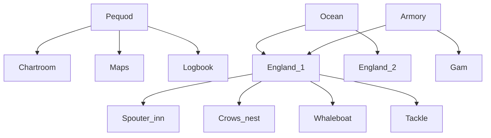

| Path | Metaphor | Intended Role | Notes |
|------|----------|---------------|-------|
| Pequod/ | Pequod | Docs & notebooks hub |  |
| Pequod/Chartroom/ | Chartroom | High-level overviews + env files |  |
| Pequod/Maps/ | Maps | Detailed architecture diagrams |  |
| Pequod/Logbook/ | Logbook | Project diary & research notes |  |
| Ocean/ | Ocean | Data lake |  |
| Ocean/England_1/ | England_1 | Premier League data |  |
| Ocean/England_2/ | England_2 | Championship data |  |
| Armory/ | Armory | Feature-engineering pipelines |  |
| Armory/Gam/ | Gam | Cross-league utilities |  |
| Armory/England_1/ | England_1 (Armory) | League-specific transforms |  |
| Armory/England_1/Spouter_inn/ | Spouter_inn | Head-to-head & league tables |  |
| Armory/England_1/Crows_nest/ | Crows_nest | Rolling-form metrics |  |
| Armory/England_1/Whaleboat/ | Whaleboat | Expected-points models |  |
| Armory/England_1/Tackle/ | Tackle | Composite rankings |  |

